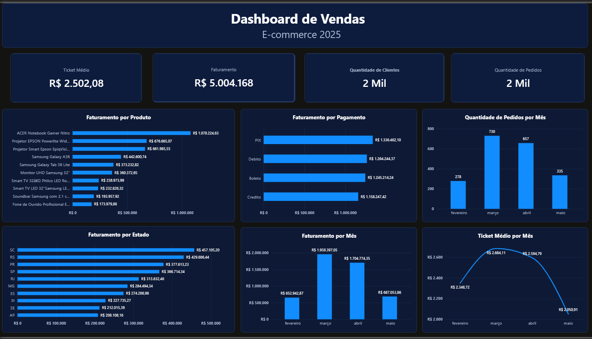

[README.md](https://github.com/user-attachments/files/32542361/README.md)
# Análise de Pedidos e Vendas — E-commerce (2025)

Projeto que fiz pra praticar o fluxo completo de um analista de dados/BI: peguei uma base de pedidos de e-commerce, explorei e validei tudo em SQL, tratei os dados em Excel/Power Query e depois montei um dashboard executivo no Power BI com DAX.

A base tem 2.000 pedidos, 2.000 clientes e 21 produtos, cobrindo o período de fevereiro a maio de 2025.

## Por que SQL primeiro

Antes de abrir o Power BI, passei um bom tempo só explorando a base no PostgreSQL. A ideia era simples: eu queria confiar nos números antes de colocar eles num gráfico. Então praticamente todo indicador que apareceu no dashboard depois já tinha sido calculado e conferido no banco.

Comecei simples, só pra entender a cara dos dados:

```sql
SELECT * FROM FACT_Orders LIMIT 10;

SELECT COUNT(*) AS total_linhas FROM FACT_Orders;
-- 2.000 pedidos

SELECT MIN(Order_Date), MAX(Order_Date) FROM FACT_Orders;
-- 16/02/2025 até 17/05/2025
```

Depois fui para os valores: menor pedido (R$ 38,54), maior pedido (R$ 18.349,54), faturamento total (R$ 5.004.168,13) e ticket médio (R$ 2.502,08), com `MIN`, `MAX`, `SUM` e `AVG`.

## Status dos pedidos

Agrupei por `Purchase_Status` pra ver como os pedidos se distribuíam:

| Status | Pedidos | Faturamento | Ticket médio |
|---|---:|---:|---:|
| Processando | 524 | R$ 1.293.093,48 | R$ 2.467,74 |
| Cancelado | 516 | R$ 1.303.772,50 | R$ 2.526,69 |
| Confirmado | 498 | R$ 1.230.174,62 | R$ 2.470,23 |
| Em Análise | 462 | R$ 1.177.127,53 | R$ 2.547,90 |

25,8% dos pedidos estão classificados como cancelados — dava pra fazer um KPI de taxa de cancelamento em cima disso. No fim decidi não colocar essa análise no dashboard, porque queria que a página final fosse uma visão executiva enxuta, focada em vendas, e não misturasse isso com o operacional. Mas fica registrado aqui que a análise foi feita e validada.

## Evolução mensal

Essa foi a consulta mais usada do projeto inteiro, porque virou base direta de três gráficos do dashboard:

```sql
SELECT
    date_trunc('month', order_date) AS mes,
    COUNT(*) AS quantidade,
    SUM(total) AS faturamento
FROM fact_orders
GROUP BY date_trunc('month', order_date)
ORDER BY faturamento DESC;
```

| Mês | Pedidos | Faturamento | Ticket médio |
|---|---:|---:|---:|
| Fevereiro | 278 | R$ 652.942,87 | R$ 2.348,72 |
| Março | 730 | R$ 1.959.397,05 | R$ 2.684,11 |
| Abril | 657 | R$ 1.704.774,35 | R$ 2.594,79 |
| Maio | 335 | R$ 687.053,86 | R$ 2.050,91 |

Março é o pico em volume e faturamento. O que eu não esperava era o comportamento do ticket médio: ele sobe até março, continua alto em abril, e despenca em maio. Ou seja, a queda de faturamento em maio não é só porque venderam menos pedidos — as pessoas também gastaram menos por pedido. São duas causas diferentes puxando o mesmo resultado, e isso só fica visível olhando ticket médio e volume juntos.

## Clientes

Contar clientes distintos parecia trivial, mas não quis simplesmente confiar que cada linha da dimensão era um cliente único:

```sql
SELECT COUNT(DISTINCT customer_name) AS clientes
FROM dim_customer;
-- 1.910 clientes distintos
```

Pra checar isso, usei `HAVING`, que filtra depois do agrupamento (diferente do `WHERE`, que filtra antes):

```sql
SELECT customer_name, COUNT(*) AS ocorrencias
FROM dim_customer
GROUP BY customer_name
HAVING COUNT(*) > 1;
```

Essa análise ajudou a validar a consistência da dimensão de clientes antes de usar `DISTINCTCOUNT` no DAX — vale lembrar que no SQL a contagem foi feita por `customer_name` e no DAX por `Customer_Id`, então não é exatamente a mesma validação, mas uma reforça a confiança na outra.

Também olhei pedidos e faturamento por cliente, pra entender se a base tinha muita concentração de compra em poucos clientes ou se era bem distribuída. Não virou gráfico no dashboard, mas ajudou a decidir que não valia a pena priorizar essa análise na página final.

## Produtos

Explorei a `DIM_Shopping` (que tem produto, quantidade e preço por item) junto com a `DIM_Products`, agrupando por produto e ordenando por faturamento. Isso virou o gráfico de Top 10 produtos do dashboard.

## Juntando tudo com JOIN

Utilizei JOINs para cruzar informações de pedidos, clientes e produtos, prestando atenção à granularidade de cada tabela para evitar duplicação de registros e distorção dos valores agregados — tanto `FACT_Orders` quanto `DIM_Customer` têm 2.000 linhas, então eu precisava ter certeza de como elas se relacionavam antes de agregar qualquer coisa. Isso acabou influenciando direto como montei os relacionamentos no modelo do Power BI depois.

## Tratando os dados no Excel

Depois do SQL, levei os dados pro Excel/Power Query, e apareceram dois problemas que valem registrar:

Números como `3586.28` estavam sendo lidos errado pelo Power Query — resolvi em Alterar Tipo → Usando Localidade → Número decimal + Inglês (Estados Unidos).

O campo `Discount` não é dinheiro, é uma fração (`0.1048` = 10,48%). Deixei como decimal e só formatei como percentual na hora de visualizar, pra não distorcer o valor.

Também bati de frente com alguns erros clássicos de atualização no Power Query — chave que não batia mais com a tabela, arquivo do Excel aberto enquanto o Power BI tentava atualizar, coluna `Id` não encontrada por causa de maiúscula/minúscula diferente no CSV. Nada muito sofisticado, mas são os tipos de erro que você só aprende resolvendo na prática.

## Modelo e DAX no Power BI

O modelo foi estruturado buscando separar a tabela de fatos das dimensões e manter relacionamentos simples entre as tabelas:

```text
DIM_Customer1 ──► FACT_Orders5
DIM_Products3 ──► DIM_Shopping4
```

Medidas principais:

```DAX
Faturamento = SUM(FACT_Orders5[Total])
Quantidade de Pedidos = COUNT(FACT_Orders5[Id])
Quantidade de Clientes = DISTINCTCOUNT(DIM_Customer1[Customer_Id])
Ticket Médio = DIVIDE([Faturamento], [Quantidade de Pedidos])
```

## O dashboard

Uma página só, de propósito. KPIs de faturamento, pedidos, ticket médio e clientes no topo, e seis gráficos embaixo: faturamento por produto, pedidos por mês, faturamento por mês, ticket médio por mês, faturamento por estado e faturamento por forma de pagamento.



Deixei de fora, por escolha:

- Faturamento por categoria — a base praticamente só tem uma categoria relevante, não fazia sentido como gráfico.
- Status e taxa de cancelamento — analisado e validado no SQL (seção acima), mas fora do dashboard pra manter a página focada em vendas.
- Detalhamento de clientes — também explorado no SQL, sem espaço na visão executiva de uma página.
- `DIM_Delivery` — cheguei a olhar, mas não era necessária pro objetivo do dashboard.

## Ferramentas

PostgreSQL, SQL (SELECT, COUNT, DISTINCT, SUM, AVG, MIN, MAX, GROUP BY, HAVING, DATE_TRUNC, JOIN, ORDER BY), Excel, Power Query, Power BI, DAX.
